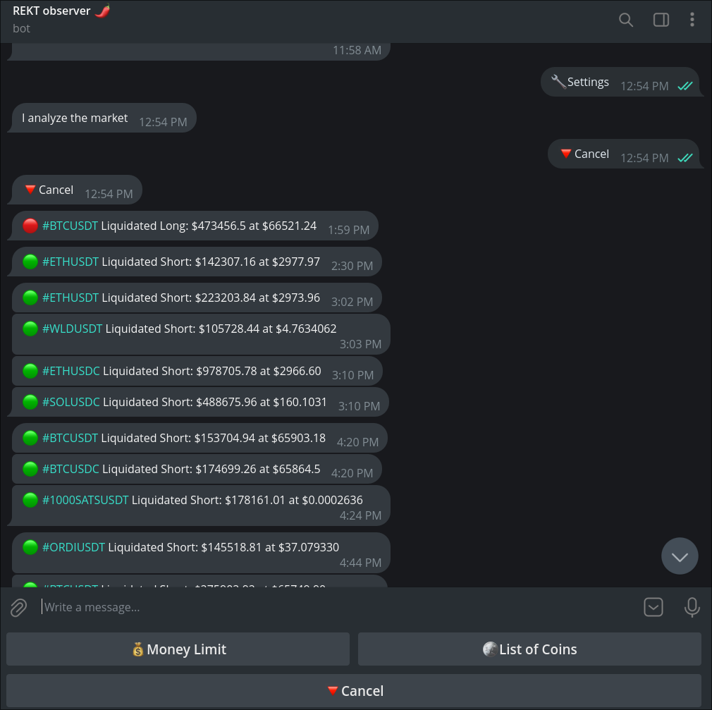

# Rekt Telegram Bot
Follow trends and get the best user experience with highly customizable functionality



## Installation
* Clone the repository or download the files
* Install the required dependencies:
```
pip install -r requirements
```
* Paste the required database credentials and API keys into the `.env` file
* Create a bot with BotFather on Telegram

## Tech Stack
* Python
* Postgresql
* Redis DB
* Binance API
* CoinMarketCap API

## Live Example
https://t.me/rekt_observer_bot
